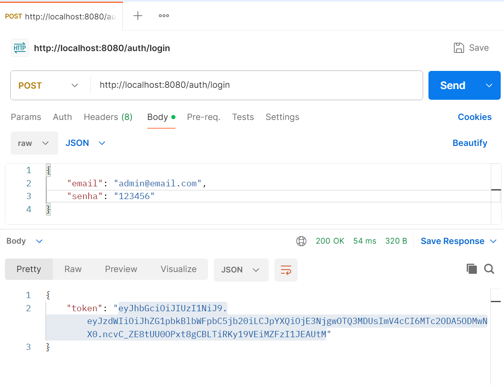
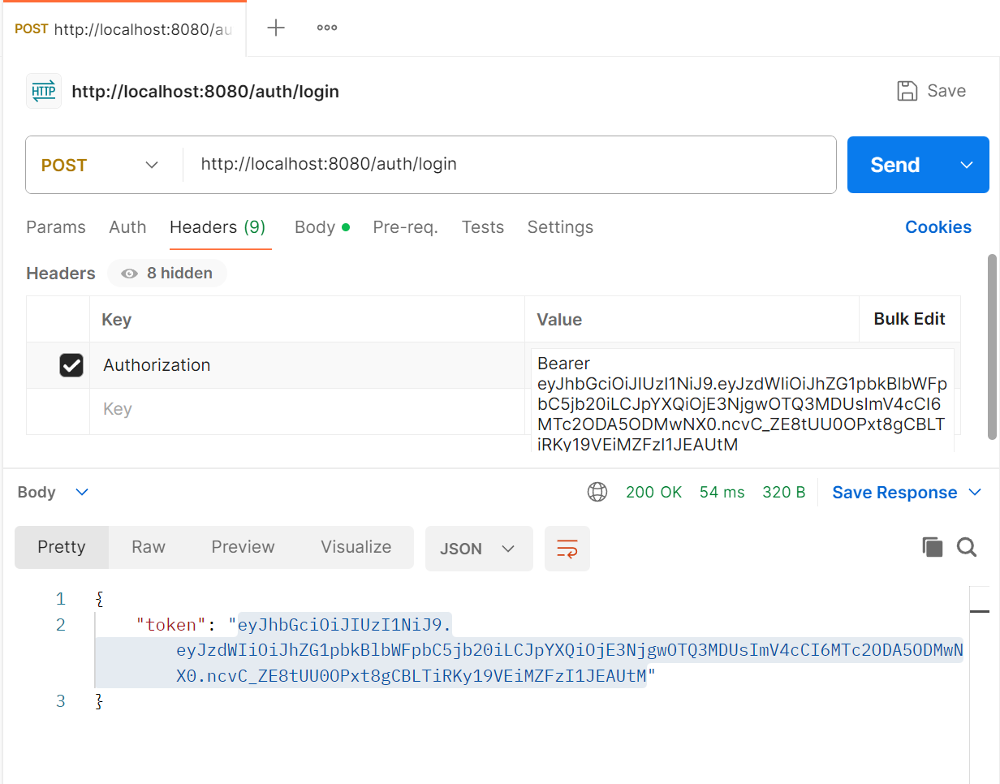
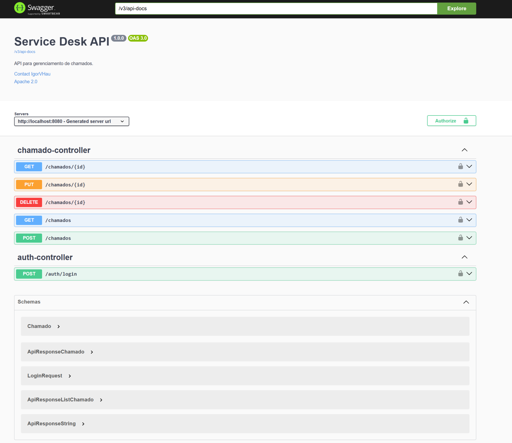
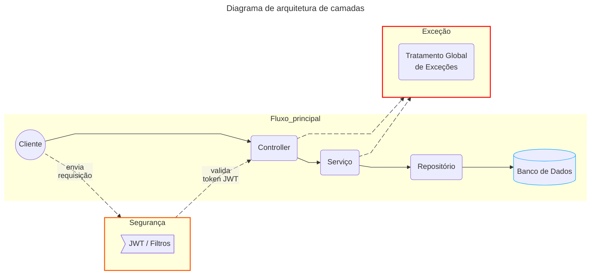

<h1 align="center">Service Desk API</h1>

<p align="center">API REST para gerenciamento de chamados, desenvolvida com <b>Java 17</b> e <b>Spring Boot 3</b>, aplicando boas práticas de arquitetura, segurança e testes.</p>

<p align="center">
	<!---->
	
	
</p>
<p align="center">
	
</p>

<br>

## 📌 Funcionalidades

- ✅ Cadastro, listagem, atualização e exclusão de chamados
- ✅ Validação de dados com Jakarta Validation
- ✅ Autenticação via JWT
- ✅ Endpoints protegidos com Spring Security
- ✅ Documentação automática com Swagger (OpenAPI 3)
- ✅ Padronização de respostas da API
- ✅ Tratamento global de exceções

## 🛠️ Tecnologias utilizadas

- Java 17
- Spring Boot 3
- Spring Data JPA
- Spring Security
- Spring Boot Actuator
- JWT (jjwt)
- H2 Database
- Lombok
- Springdoc OpenAPI (Swagger)
- JUnit 5
- Mockito

## ▶️ Execução e consumo da API

Como pré-requisitos básicos, certifique-se de ter **Java 17+** e **Maven** instalados no ambiente. 

### Execução da API
A aplicação pode ser executada via terminal ou por qualquer IDE Java (IntelliJ, Eclipse, VS Code). Para isso, importe o projeto usando a IDE Java de sua preferência ou abra o terminal (PowerShell, Terminal do Linux/macOS ou Git Bash no Windows) e execute os comandos:

```bash
git clone https://github.com/IgorVHau/gestao-chamados-java-api.git
cd gestao-chamados-java-api
```
Execute a API por meio da IDE escolhida ou pelo comando ```mvn spring-boot:run``` caso opte por rodar via terminal. A aplicação subirá em ```http://localhost:8080```.

### Autenticação e Segurança
A API utiliza autenticação baseada em **JWT (JSON Web Token)** para proteger seus endpoints, com filtro de segurança customizado e integração com Swagger para autorização via token.

Antes de realizar alguma operação na API, é necessário autenticar o usuário por meio de login e senha. Caso contrário, todas as operações serão bloqueadas.

⚠️ **Atenção**: as credenciais abaixo são fictícias e utilizadas apenas para fins de teste local.

| Usuário | E-mail | Senha | Perfil |
|:-------:|:-------:|:-------:|:-------:|
| Jorge | user@email.com | 654321 | USER |
| Fernando | admin@email.com | 123456 | ADMIN |

---------------------------------------------------------------
O fluxo de autenticação pode ser descrito da seguinte forma:

1. Realize uma requisição **POST** para `/auth/login`, preferencialmente via uma Client API, como Postman ou Insomnia.
2. Envie no body um JSON contendo os campos `"email"` e `"senha"` preenchendo os valores de acordo com as informações fornecidas na tabela acima.
3. Após autenticação bem-sucedida, a API retornará um **token JWT** conforme ilustrado abaixo.

4. Ao realizar uma chamada na API, utilize o token no header `Authorization` com o prefixo `Bearer` como na imagem abaixo.


🕐 O token possui tempo de expiração configurado para ser válido por 1 hora. Após esse período, é necessário realizar uma nova autenticação para obter um novo token.

### Consumo da API
  Após o processo de autenticação, a API estará pronta para o consumo por meio de requisições HTTP realizadas via Client API ou Swagger UI. Abaixo estão as informações necessárias para a realização de cada requisição. Todos os endpoints abaixo são protegidos e exigem autenticação conforme descrito na subseção Autenticação e Segurança.

🟡 ***Ler todos os chamados registrados***

- **URL:** `/chamados`
- **HTTP Method:** `GET`
- **Authorization:** `USER, ADMIN`

🟡 ***Ler o chamado correspondente ao id informado***

- **URL:** `/chamados/{id}`
- **HTTP Method:** `GET`
- **Authorization:** `USER, ADMIN`

🟢 ***Criar chamado para ser registrado no banco***

- **URL:** `/chamados`
- **HTTP Method:** `POST`
- **Authorization:** `ADMIN`
- **Content-Type:** `application/json`
- **Request body (exemplo):**
```json
	{
	"titulo": "TÍTULO",
	"descricao": "DESCRIÇÃO",
	"status": "ABERTO"
	}
```

🔵 ***Editar chamado correspondente ao id informado***
- **URL:** `/chamados/{id}`
- **HTTP Method:** `PUT`
- **Authorization:** `ADMIN`
- **Content-Type:** `application/json`
- **Request body (exemplo):**
```json
	{
	"titulo": "TÍTULO",
	"descricao": "DESCRIÇÃO",
	"status": "EM_ANDAMENTO"
	}
```

🔴 ***Remover chamado correspondente ao id informado***
- **URL:** `/chamados/{id}`
- **HTTP Method:** `DELETE`
- **Authorization:** `ADMIN`

> 📘 Para exemplos completos de requisições e respostas, utilize o Swagger UI disponível em `/swagger-ui/index.html`.

###### ⚠️ Regras e validações importantes
- Os campos `"titulo"`, `"descrição"` e `"status"` são obrigatórios nos métodos POST e PUT.
- O campo `"status"` só aceita os valores: `"ABERTO"`, `"EM_ANDAMENTO"` e `"CONCLUIDO"`.
- Chamados com status `"CONCLUIDO"` não podem ser atualizados.


### Documentação da API

A API é documentada utilizando o padrão OpenAPI 3. Após iniciar a aplicação, os recursos de documentação estarão disponíveis em:

- Swagger UI (interface interativa): 
```bash
http://localhost:8080/swagger-ui/index.html
```
Abaixo segue um exemplo da interface Swagger UI exibindo os endpoints disponíveis entre outras informações da aplicação.



- OpenAPI Specification (JSON):
```bash
http://localhost:8080/v3/api-docs
```

Por meio dessas ferramentas, é possível:
- Visualizar todos os endpoints disponíveis
- Analisar o contrato da API (paths, schemas, responses e segurança)
- Realizar autenticação via JWT
- Executar requisições diretamente pelo navegador

## 🧪 Testes

O projeto possui testes automatizados utilizando **JUnit 5** e **Mockito**, cobrindo diferentes camadas da aplicação.

Foram implementados 2 tipos de testes, [os testes unitários de serviço](src/test/java/service_desk_api/api/service/ChamadoServiceTest.java) e [testes de camada Web](src/test/java/service_desk_api/api/controller/ChamadoControllerTest.java).
Os testes unitários de serviço validam regras de negócio de forma isolada com dependências mockadas. Os testes de camada Web (Controller) utilizam anotações `WebMvcTest` e `MockMvc` para validação de estrutura das respostas JSON, status HTTP, tratamento de exceções e contratos dos endpoints.

Para executar todos os testes automatizados, execute o comando:

```bash
mvn test
```

## 📐 Arquitetura

A aplicação segue uma arquitetura em camadas, muito comum em aplicações Spring Boot, separando responsabilidades para facilitar a legibilidade, manutenção e realização de testes.

Embora o padrão Clean Architecture não tenha sido implementado integralmente, pode-se dizer que o projeto emprega alguns de seus princípios fundamentais, como separação de responsabilidades, baixo acoplamento entre camadas e isolamento das regras de negócio.

Cada camada possui um papel bem definido:

- **[Controller](src/main/java/service_desk_api/api/controller)** – responsável pela exposição dos endpoints REST, validação de entrada e definição do código das respostas HTTP.
- **[Service](src/main/java/service_desk_api/api/service)** – contém as regras de negócio da aplicação e orquestra o fluxo entre controller e repositório.
- **[Repository](src/main/java/service_desk_api/api/repository)** – representa a camada de acesso a dados. Utiliza Spring Data JPA para abstrair operações com o banco de dados.
- **[Model](src/main/java/service_desk_api/api/model)** – representa as entidades centrais da aplicação e o estado do negócio. É utilizado principalmente nas camadas de Serviço e Repositório, onde ocorre a manipulação e persistência dos dados.
- **[DTO](src/main/java/service_desk_api/api/dto)** – utilizado na comunicação entre Controller e Cliente, evitando o acoplamento direto com o modelo de domínio.
Permite validação de entrada, controle de campos expostos e versionamento da API.
- **[Config](src/main/java/service_desk_api/api/config)** - contém configurações transversais da aplicação, como segurança (Spring Security, JWT, filtros), documentação OpenAPI, definição de beans e integração com o ecossistema Spring.
- **[Exception Handler](src/main/java/service_desk_api/api/exception)** – responsável pelo tratamento centralizado de erros e respostas padronizadas para o cliente.

Não há uma camada específica dedicada à segurança nessa aplicação. A segurança (JWT, autenticação e autorização) é tratada de forma transversal, principalmente nas camadas de configuração e serviço.

Abaixo a representação visual do diagrama de arquitetura.


Domínio (Model) e DTOs não representam etapas do fluxo da requisição, mas estruturas de dados utilizadas entre as camadas. Por isso, essas camadas não estão ilustradas no diagrama acima.

Esse modelo de arquitetura permite:

- Testes unitários isolados na camada de serviço

- Evolução da aplicação sem impacto direto em outras camadas

- Padronização de respostas e tratamento de erros

- Separação clara entre infraestrutura, domínio e apresentação

## 🗂️ Perfis de ambiente

O projeto possui perfis de ambientes (dev e prod) para simular comportamentos diferentes entre desenvolvimento e produção. 
No perfil [dev](src/main/resources/application-dev.yml), a aplicação faz uso de banco H2 em memória, logs SQL habilitados e schema criado automaticamente. O foco é mais voltado para desenvolvimento local.
No perfil [prod](src/main/resources/application-prod.yml), as configurações estão preparadas para banco externo (PostgreSQL), validação de schema e credenciais via variáveis de ambiente. O ambiente é pensado para simular execução em ambientes produtivos.

## 🔬 Monitoramento e Observabilidade

A aplicação utiliza **Spring Boot Actuator** para expor informações operacionais e de build. Para monitorar a aplicação por meio dessa ferramenta, verifique as informações abaixo.

| Método HTTP | Endpoint | Permissão |
|:----------:|:----------|:----------|
|🟡GET|/actuator/info|ADMIN🔐|

Exemplo de informações expostas:
- Nome e versão da aplicação
- Dados de build (artifact, versão, data)
- Metadados do Git (branch, commit, timestamp)

Essas informações são acessadas através do [pom.xml](pom.xml) e do repositório Git.

## 📌 Observação
Este projeto foi desenvolvido com foco em aprendizado prático, evolução técnica e aplicação de boas práticas no ecossistema Spring.
